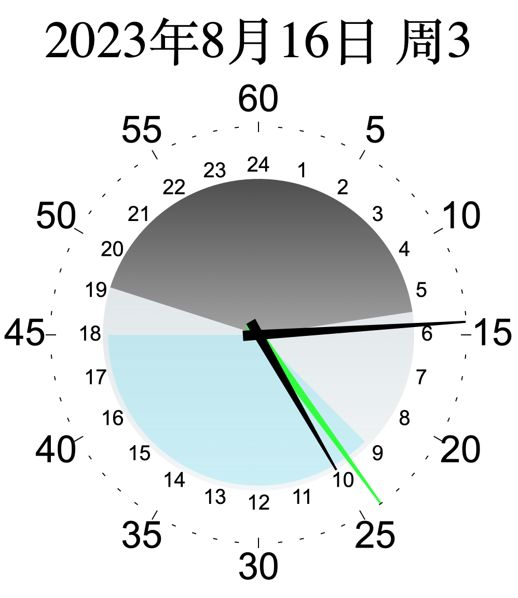

# 24hOneCircle

canvas 画的表。
- 时针 24 小时一圈。
- 结合了日出日落时间，灰色部分是夜晚。
- 兼容高清屏
***
A clock on canvas
- With a 24-hour hand completing one full rotation. 
- Combined with sunrise and sunset times, the gray area represents the nighttime.
- Compatibility with high-resolution screens